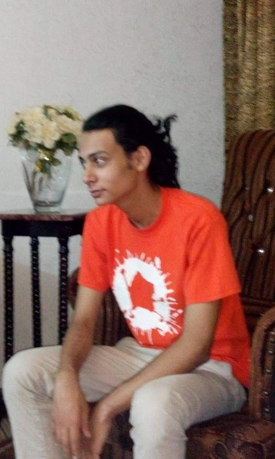

# my-notes
**_Hello everyone_**.

My name is **Omar Darweesh**
I'm a **CS** graduate from **Jadara University**, im a result driven student passionate about coding and web development, i really enjoy working on myself and adding to my skills in the industry, hoping one day ill be able to be great full stack developer.
really looking forward to code with you all.

## My strong points are:
* C++
* C#
* HTML
* Arduino
* SQL

# My summarization about a good developer mindset: 

1. The first thing that a developer must think about when making a new software is the main purpose of the software or the problem that needs to be solved.
2. Designing the software must be done in a way that makes it easier for the developers and more useful to the users.
3. Understanding our work as developers makes the software more simple without any comlexity.
5. our main purpose as devs is to control comlex softwares not to make it more complex.
6. We must spend more than enough time on the implementation procces so that we dont waste more time on the maintenance.
7. code must be consistent
8. The program must be solving the problem step by step.

